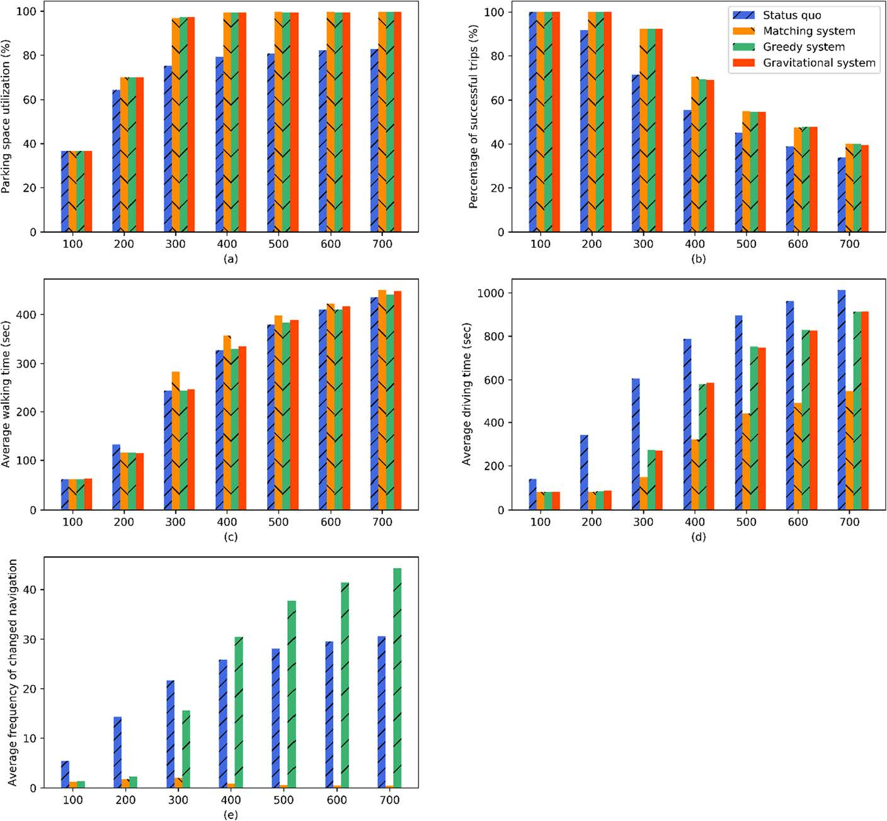
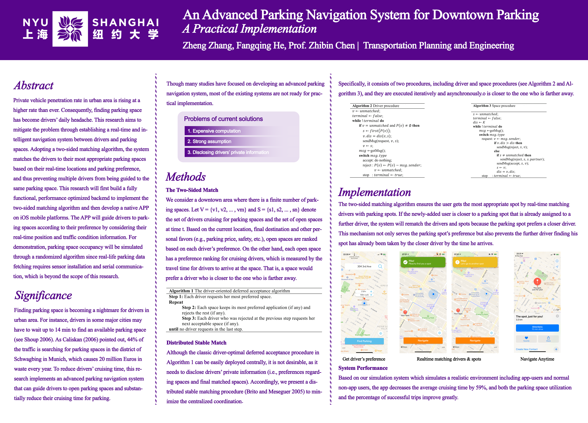

# Pika Park: Find THE SPACE in a snap!

Zheng Zhang, Fangqing He

Pika-park is a novel real-time, strategy-proof parking space assignment & navigation system that mitigates inter-driver competition while optimizing system-wise Cruising for Parking time through assigning users the most appropriate parking spaces for them.

## Data

The geolocation data of parking meters come from [NYC Open Data](https://data.cityofnewyork.us/Transportation/Parking-Meters-GPS-Coordinates-and-Status/5jsj-cq4s). It provides the precise **GPS Coordinates** and **operation status** of more than 14k parking meters located in the New York City.

The operation status is used to filter out non-functioning meters, and the GPS coordinates are used to match drivers with the closest parking space that satisfies their parking preference while taking into consideration the inter-driver competition caused by parking demand.  

For lack of implemented sensors, transmission, and hosting services, the realtime occupancy data of parking meters are generated randomly using Poisson's distribution function. However, if such data becomes available in the future, it is possible to plug in our system using API calls to databases.

## Algorithm

This systen is built upon the **Distributed Extended Gale-Shapley (DisEGS)** algorithm proposed by Gale and Shapley in Chen *et al.*'s paper. In general, it ensures a stable two-sided matching between two parties. In the context of our project, we make the matching process biased toward **drivers** instead of parking meters in order to achieve driver-optimal matching results so that parking demand can be relieved ASAP. 

The key of the algorithm is that it matches all drivers to **the most appropriate spots**, meaning that these spots are the spots that i) satisfy drivers' preferences in parking price, walking distance from parking space to destination, etc. and ii) are the best spots a driver can practically obtain given the time/distance from his/her current location to the destination. The second point is achieved thanks to the matching happening on the meter side, where the closer drivers are preferred. In this way, the inter-driver competition can be mitigated and system-wise Cruising for Parking time can be optimized.

## Implementation

The system consitsts of a client frontend and server backend.

The frontend is an iOS native application developed in **Swift** and **Objective**-C. The core-component of this app is built upon Apple's [MapKit](https://developer.apple.com/documentation/mapkit). To make it more user-friendly, two Pods: [RevealingSplashView](https://github.com/PiXeL16/RevealingSplashView) and [SwiftMessages](https://github.com/SwiftKickMobile/SwiftMessages) are utilized.

The backend is built by vanilla **Node.js**. The driver and parking meter procedure described in Chen *et al.*'s paper is combined to run on a singer server. With future IoT technologies, the two procedures can be easily decoupled to run on parking meters and local smart phones.

This repo hosts only the frontend of Pika Park. Here is a [link](https://github.com/QuinnHe/SPN-backend) to the backend of the system which I also contributed to during the summer of 2019.

## Performance

The matching system is simulated on [NetLogo](https://ccl.northwestern.edu/netlogo/), and further compared with the gravitational system (Ayala *et al.*, 2012), a greedy navigation system that always guides drivers to their most preferred open spaces, and a status-quo scenario with neither navigation nor information provision.

Below is the comparision result:

Chart (d) indicates that the matching system can lead to a larger amount of average driving-time saving than the other two navigation systems, and such superiority can become more remarkable when the parking demand increases.

In chart (e), with the increasing parking demand, the average frequency of changed navigation under thestatus quo and the greedy system increases significantly. This result makes sense, since under these two scenarios, higher parking demand will lead to more severe parking competition, and drivers have to frequently drive toward distinguishing parking spaces in order to find an open one. In contrast, the average frequency of changed navigation associated with the matching system is relatively stable, and even decreases as the parking demand increases from 300 veh/h. The reason is straightforward. According to the matching system, one open parking space can be assigned to at most one driver at any time, and thus some drivers may not be guided to any open parking space. Consequently, the total frequency of changed navigation may not vary much as the demand increases, which results in a decrease in the average frequency of changed navigation.

## Achievement

Funded by the [Dean's Undergraduate Research Fund (DURF)](https://shanghai.nyu.edu/academics/undergraduate-research), this project had the honor to win the sole **First Place Project** award out of 13 submitted faculty-led summer research at [2019 Undergrad Research Expo and Poster Competition](https://mailchi.mp/nyu/a-way-forward-on-us-china-trade-highlights-from-halloween). Check the proposal of this project [here](./readme/DURF_Proposal.pdf).

## Presentation Poster

## Reference

Ayala D, Wolfson O, Xu B, DasGupta B, Lin J (2012) Parking in competitive settings: a gravitational approach. In *Mobile Data Management* (MDM), 2012 IEEE 13th International Conference on (pp 27–32). IEEE

Brito, I., & Meseguer, P. (2005, October). Distributed stable matching problems. In *International Conference on Principles and Practice of Constraint Programming* (pp. 152-166). Springer, Berlin, Heidelberg.

Chen, Z., Spana, S., Yin, Y., & Du, Y. (2019). An Advanced Parking Navigation System for Downtown Parking. *Networks and Spatial Economics*, 1-16.

Gale, D., & Shapley, L. S. (1962). College admissions and the stability of marriage. *The American Mathematical Monthly*, 69(1), 9-15.